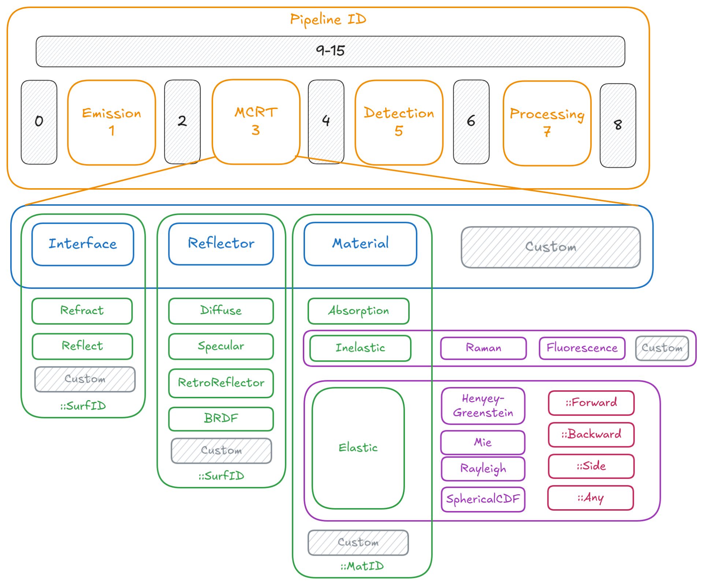

# Model EventType Ledger Design
The ledger will be composed of two hash maps (key-value stores) that allows us to traverser the unique IDs (UID) of each event in each generation sequence.

The photons collected are received in packets composed of:
```Rust
struct Photon {
    tof:f64,
    power: f64,
    wavelength:f64,
    pos: Pos3,
    dir: Dir3,
    uid: UID
}
struct UID {
    seq_no: u32,
    type: EventType
}
```

The following specification focuses mostly on how to encode the `EventType`, but also gives a usage example below.



## Encoding Scheme

```bytefield
(defattrs :plain [:plain {:font-family "M+ 1p Fallback" :font-size 18}])
(def row-height 36)
(def left-margin 20)
(def right-margin 30)
(def row-header-fn nil)
(def boxes-per-row 24)

(draw-box nil {:span 24 :borders {}})
(draw-box (text "Encoding  Scheme" {:font-weight "bold" :font-size 20}) {:span 20 :borders {}})
(draw-box nil {:span 4 :borders {}})

(draw-box "31" {:span 1 :text-anchor "start" :borders{}})
(draw-box "28" {:span 1 :text-anchor "end" :borders {}})
(draw-box "27" {:span 2 :text-anchor "start" :borders {}})
(draw-box "24" {:span 2 :text-anchor "end" :borders {}})
(draw-box "23" {:span 2 :text-anchor "start" :borders {}})
(draw-box "22" {:span 2 :text-anchor "end" :borders {}})
(draw-box "21" {:span 2 :text-anchor "start" :borders {}})
(draw-box "16" {:span 4 :text-anchor "end" :borders {}})
(draw-box "15" {:span 2 :text-anchor "start" :borders {}})
(draw-box "0" {:span 2 :text-anchor "end" :borders {}})
(draw-box nil {:span 4 :borders {}})

(draw-box "Reserved" {:span 2})
(draw-box "Pipeline" {:span 4})
(draw-box "EventType" {:span 10})
(draw-box "SrcId" {:span 4})
(draw-box "Generic" {:span 4 :borders {}})

(draw-box "Reserved" {:span 2})
(draw-box "0001" {:span 4})
(draw-box "EventType" {:span 10})
(draw-box "LightId" {:span 4})
(draw-box "Emission Event" {:span 4 :borders {}})

(draw-box "Reserved" {:span 2})
(draw-box "0011" {:span 4})
(draw-box "SuperType" {:span 4})
(draw-box "SubType" {:span 6})
(draw-box "MatSurfId" {:span 4})
(draw-box "MCRT Event" {:span 4 :borders {}})

(draw-box nil {:span 24 :borders {}})
(draw-box (text "MCRT Events" {:font-weight "bold" :font-size 20}) {:span 20 :borders {}})
(draw-box nil {:span 4 :borders {}})

(draw-box "_" {:span 2})
(draw-box "0011 (MCRT)" {:span 4})
(draw-box "00" {:span 4})
(draw-box "SubType" {:span 6})
(draw-box "MatSurfId" {:span 4})
(draw-box "  Interface" {:span 4 :text-anchor "start" :borders {}})

(draw-box "_" {:span 2})
(draw-box "MCRT" {:span 4})
(draw-box "01" {:span 4})
(draw-box "SubType" {:span 6})
(draw-box "MatSurfId" {:span 4})
(draw-box "  Reflector" {:span 4 :text-anchor "start" :borders {}})

(draw-box "_" {:span 2})
(draw-box "MCRT" {:span 4})
(draw-box "10" {:span 4})
(draw-box "SubType" {:span 6})
(draw-box "MatSurfId" {:span 4})
(draw-box "  Material" {:span 4 :text-anchor "start" :borders {}})

(draw-box "_" {:span 2})
(draw-box "MCRT" {:span 4})
(draw-box "11" {:span 4})
(draw-box "SubType" {:span 6})
(draw-box "MatSurfId" {:span 4})
(draw-box "  Custom" {:span 4 :text-anchor "start" :borders {}})

(draw-box nil {:span 24 :borders {}})
(draw-box (text " Interface Events" {:font-weight "bold" :font-size 20}) {:span 20 :borders {}})
(draw-box nil {:span 4 :borders {}})

(draw-box "_" {:span 2})
(draw-box "MCRT" {:span 4})
(draw-box "Interface" {:span 4})
(draw-box "000000" {:span 6})
(draw-box "SurfId" {:span 4})
(draw-box "  Reflection" {:span 4 :text-anchor "start" :borders {}})

(draw-box "_" {:span 2})
(draw-box "MCRT" {:span 4})
(draw-box "Interface" {:span 4})
(draw-box "000001" {:span 6})
(draw-box "SurfId" {:span 4})
(draw-box "  Refraction" {:span 4 :text-anchor "start" :borders {}})

(draw-box "_" {:span 2})
(draw-box "MCRT" {:span 4})
(draw-box "Interface" {:span 4})
(draw-box "000100" {:span 6})
(draw-box "SurfId" {:span 4})
(draw-box "  ReEmittance" {:span 4 :text-anchor "start" :borders {}})

(draw-box "_" {:span 2})
(draw-box "MCRT" {:span 4})
(draw-box "Interface" {:span 4})
draw-box "1xxxxx" {:span 6})
(draw-box "SurfId" {:span 4})
(draw-box "  Custom" {:span 4 :text-anchor "start" :borders {}})

(draw-box nil {:span 24 :borders {}})
(draw-box (text " Reflector Events" {:font-weight "bold" :font-size 20}) {:span 20 :borders {}})
(draw-box nil {:span 4 :borders {}})

(draw-box "_" {:span 2})
(draw-box "MCRT" {:span 4})
(draw-box "Reflector" {:span 4})
(draw-box "00001x" {:span 6})
(draw-box "SurfId" {:span 4})
(draw-box "  Diffuse" {:span 4 :text-anchor "start" :borders {}})

(draw-box "_" {:span 2})
(draw-box "MCRT" {:span 4})
(draw-box "Reflector" {:span 4})
(draw-box "00010x" {:span 6})
(draw-box "SurfId" {:span 4})
(draw-box "  Specular" {:span 4 :text-anchor "start" :borders {}})

(draw-box "_" {:span 2})
(draw-box "MCRT" {:span 4})
(draw-box "Reflector" {:span 4})
(draw-box "00011x" {:span 6})
(draw-box "SurfId" {:span 4})
(draw-box "  Composite" {:span 4 :text-anchor "start" :borders {}})

(draw-box "_" {:span 2})
(draw-box "MCRT" {:span 4})
(draw-box "Reflector" {:span 4})
(draw-box "001000" {:span 6})
(draw-box "SurfId" {:span 4})
(draw-box "  RetroReflective" {:span 4 :text-anchor "start" :borders {}})

(draw-box "_" {:span 2})
(draw-box "MCRT" {:span 4})
(draw-box "Reflector" {:span 4})
(draw-box "001001" {:span 6})
(draw-box "SurfId" {:span 4})
(draw-box "  CompRetroRef" {:span 4 :text-anchor "start" :borders {}})

(draw-box "_" {:span 2})
(draw-box "MCRT" {:span 4})
(draw-box "Reflector" {:span 4})
(draw-box "001001" {:span 6})
(draw-box "SurfId" {:span 4})
(draw-box "  CompRetroRef" {:span 4 :text-anchor "start" :borders {}})
```

```bytefield
(defattrs :plain [:plain {:font-family "M+ 1p Fallback" :font-size 18}])
(def row-height 36)
(def left-margin 20)
(def right-margin 30)
(def row-header-fn nil)
(def boxes-per-row 24)

(draw-box nil {:span 24 :borders {}})
(draw-box (text "Material  Events" {:font-weight "bold" :font-size 20}) {:span 20 :borders {}})
(draw-box nil {:span 4 :borders {}})

(draw-box "31" {:span 1 :text-anchor "start" :borders{}})
(draw-box "28" {:span 1 :text-anchor "end" :borders {}})
(draw-box "27" {:span 1 :text-anchor "start" :borders {}})
(draw-box "24" {:span 1 :text-anchor "end" :borders {}})
(draw-box "23" {:span 1 :text-anchor "start" :borders {}})
(draw-box "22" {:span 1 :text-anchor "end" :borders {}})
(draw-box "21" {:span 1 :text-anchor "start" :borders {}})
(draw-box "20" {:span 2 :text-anchor "end" :borders {}})
(draw-box "19" {:span 2 :text-anchor "start" :borders {}})
(draw-box "18" {:span 2 :text-anchor "end" :borders {}})
(draw-box "17" {:span 2 :text-anchor "start" :borders {}})
(draw-box "16" {:span 1 :text-anchor "end" :borders {}})
(draw-box "15" {:span 2 :text-anchor "start" :borders {}})
(draw-box "0" {:span 2 :text-anchor "end" :borders {}})
(draw-box nil {:span 4 :borders {}})

(draw-box "Reserved" {:span 2})
(draw-box "Pipeline" {:span 2})
(draw-box "Material" {:span 2})
(draw-box "SubType" {:span 10})
(draw-box "MatId" {:span 4})
(draw-box nil {:span 4 :borders {}})

(draw-box "Reserved" {:span 2})
(draw-box "Pipeline" {:span 2})
(draw-box "Material" {:span 2})
(draw-box "Interaction" {:span 3})
(draw-box "Extra" {:span 7})
(draw-box "MatId" {:span 4})
(draw-box nil {:span 4 :borders {}})

(draw-box "Reserved" {:span 2})
(draw-box "Pipeline" {:span 2})
(draw-box "Material" {:span 2})
(draw-box "Interaction" {:span 3})
(draw-box "ScatterType" {:span 4})
(draw-box "Direction" {:span 3})
(draw-box "MatId" {:span 4})
(draw-box nil {:span 4 :borders {}})

(draw-box nil {:span 24 :borders {}})

(draw-box "_" {:span 2})
(draw-box "MCRT" {:span 2})
(draw-box "Material" {:span 2})
(draw-box "00" {:span 3})
(draw-box "xxxxxx" {:span 7})
(draw-box "MatId" {:span 4})
(draw-box "Absorption" {:span 4 :borders {}})

(draw-box "_" {:span 2})
(draw-box "MCRT" {:span 2})
(draw-box "Material" {:span 2})
(draw-box "01" {:span 3})
(draw-box "ScatterType" {:span 4})
(draw-box "Direction" {:span 3})
(draw-box "MatId" {:span 4})
(draw-box "Inelastic" {:span 4 :borders {}})

(draw-box "_" {:span 2})
(draw-box "MCRT" {:span 2})
(draw-box "Material" {:span 2})
(draw-box "10" {:span 3})
(draw-box "ScatterType" {:span 4})
(draw-box "Direction" {:span 3})
(draw-box "MatId" {:span 4})
(draw-box "Elastic" {:span 4 :borders {}})

(draw-box "_" {:span 2})
(draw-box "MCRT" {:span 2})
(draw-box "Material" {:span 2})
(draw-box "11" {:span 3})
(draw-box "xxxxxx" {:span 7})
(draw-box "MatId" {:span 4})
(draw-box "Custom" {:span 4 :borders {}})

(draw-box nil {:span 24 :borders {}})
(draw-box (text "Inelastic Scattering  Events" {:font-weight "bold" :font-size 20}) {:span 20 :borders {}})
(draw-box nil {:span 4 :borders {}})

(draw-box "_" {:span 2})
(draw-box "MCRT" {:span 2})
(draw-box "Material" {:span 2})
(draw-box "Inelastic" {:span 3})
(draw-box "00" {:span 4})
(draw-box "Direction" {:span 3})
(draw-box "MatId" {:span 4})
(draw-box "Raman" {:span 4 :borders {}})

(draw-box "_" {:span 2})
(draw-box "MCRT" {:span 2})
(draw-box "Material" {:span 2})
(draw-box "Inelastic" {:span 3})
(draw-box "01" {:span 4})
(draw-box "Direction" {:span 3})
(draw-box "MatId" {:span 4})
(draw-box "Fluorescence" {:span 4 :borders {}})

(draw-box "_" {:span 2})
(draw-box "MCRT" {:span 2})
(draw-box "Material" {:span 2})
(draw-box "Inelastic" {:span 3})
(draw-box "1x" {:span 4})
(draw-box "Direction" {:span 3})
(draw-box "MatId" {:span 4})
(draw-box "Custom" {:span 4 :borders {}})

(draw-box nil {:span 24 :borders {}})
(draw-box (text "Elastic Scattering  Events" {:font-weight "bold" :font-size 20}) {:span 20 :borders {}})
(draw-box nil {:span 4 :borders {}})

(draw-box "_" {:span 2})
(draw-box "MCRT" {:span 2})
(draw-box "Material" {:span 2})
(draw-box "Elastic" {:span 3})
(draw-box "00" {:span 4})
(draw-box "Direction" {:span 3})
(draw-box "MatId" {:span 4})
(draw-box "Henyey-Greenstein" {:span 4 :borders {}})

(draw-box "_" {:span 2})
(draw-box "MCRT" {:span 2})
(draw-box "Material" {:span 2})
(draw-box "Elastic" {:span 3})
(draw-box "01" {:span 4})
(draw-box "Direction" {:span 3})
(draw-box "MatId" {:span 4})
(draw-box "Mie" {:span 4 :borders {}})

(draw-box "_" {:span 2})
(draw-box "MCRT" {:span 2})
(draw-box "Material" {:span 2})
(draw-box "Elastic" {:span 3})
(draw-box "10" {:span 4})
(draw-box "Direction" {:span 3})
(draw-box "MatId" {:span 4})
(draw-box "Rayleigh" {:span 4 :borders {}})

(draw-box "_" {:span 2})
(draw-box "MCRT" {:span 2})
(draw-box "Material" {:span 2})
(draw-box "Elastic" {:span 3})
(draw-box "11" {:span 4})
(draw-box "Direction" {:span 3})
(draw-box "MatId" {:span 4})
(draw-box "SphericalCDF" {:span 4 :borders {}})

(draw-box nil {:span 24 :borders {}})
(draw-box (text "Direction Description" {:font-weight "bold" :font-size 20}) {:span 20 :borders {}})
(draw-box nil {:span 4 :borders {}})

(draw-box "_" {:span 2})
(draw-box "MCRT" {:span 2})
(draw-box "Material" {:span 2})
(draw-box "Elastic" {:span 3})
(draw-box "ScatterType" {:span 4})
(draw-box "00" {:span 3})
(draw-box "MatId" {:span 4})
(draw-box "Any" {:span 4 :borders {}})

(draw-box "_" {:span 2})
(draw-box "MCRT" {:span 2})
(draw-box "Material" {:span 2})
(draw-box "Elastic" {:span 3})
(draw-box "ScatterType" {:span 4})
(draw-box "01" {:span 3})
(draw-box "MatId" {:span 4})
(draw-box "Forward" {:span 4 :borders {}})

(draw-box "_" {:span 2})
(draw-box "MCRT" {:span 2})
(draw-box "Material" {:span 2})
(draw-box "Elastic" {:span 3})
(draw-box "ScatterType" {:span 4})
(draw-box "10" {:span 3})
(draw-box "MatId" {:span 4})
(draw-box "Side" {:span 4 :borders {}})

(draw-box "_" {:span 2})
(draw-box "MCRT" {:span 2})
(draw-box "Material" {:span 2})
(draw-box "Elastic" {:span 3})
(draw-box "ScatterType" {:span 4})
(draw-box "11" {:span 3})
(draw-box "MatId" {:span 4})
(draw-box "Backward" {:span 4 :borders {}})
```

## Ledger Show-case

| UID { seq_no, type} | next(seq_no) | Description/Ptr to struct definition |
| --- | --- | --- |
| {1, Laser} | 2   | Laser emission |
| {1, Background } | 3   | Background emission |
| {2, FS{Mat{Air}}} | 4   | Forward scatter with air |
| {2, BS{Mat{Air}}} | 5   | Background scatter with air |
| {2, Reflection{Mat{TransPLA}}} | 6   | Reflection from Fresnel refraction with target |
| {2, Refraction{Mat{TransPLA}}} | 7   | Refraction from Fresnel refraction with target |
| {7, FS{Mat{TransPLA}}} | 8   | Forward scatter target |
| {8, FS{Mat{TransPLA}}} | 9   | Forward scatter target |
| {9, BS{Mat{TransPLA}}} | 10  | Forward scatter target |
| {10, Refraction{Mat{Air}}} | 11  | Refraction from Fresnel refraction back to air |
| {11, Detection{PhotonCollector}} | 12  | Detected at apperture of SPAD sensor from SSS |
| {6, Detection{PhotonCollector}} | 13  | SPAD Detection of balistic |
| seq_no | UID |
| \--- | \--- |
| 1   | {0, Root} |
| 2   | {1,Laser} |
| 3   | {2, Background} |
| 4   | {2, FS{Mat{Air}}} |
| 6   | {2, Reflection{Mat{TransPLA}}} |
| 7   | {2, Refraction{Mat{TransPLA}}} |
| 8   | {7, FS{Mat{TransPLA}}} |
| 9   | {8, FS{Mat{TransPLA}}} |
| 10  | {9, BS{Mat{TransPLA}}} |
| 11  | {10, Refraction{Mat{Air}}} |
| 12  | {11, Detection{PhotonCollector}} |

### Filter example

`photon.filter_deny(type:Background).filter_deny(type:SSS{TranslucentPLA}).filter_allow(type:Reflection/Refraction{Mat{TranslucentPLA})`

`photon.filter_deny(type:Background).filter_allow(type:SSS{TranslucentPLA})`

## UID & EventType values encoding

```Julia
abstract type AbstractEvent end
abstract type SubTypeAbstract <: UInt6;
abstract type MatSurfId <: UInt16;
struct MatId = MatSurfId;
struct SurfId = MatSurfId;

type SurfId <: MatSurfId

@enum SuperType <: UInt2
    Interface = 0,
    Reflector = 1,
    Material = 2,
    Custom = 3,
end

@enum Pipeline <: UInt4
    # Custom = 0 
    Emisssion = 1,
    # Custom = 2 
    MCRT = 3,
    # Custom = 4 
    Detection = 5,
    # Custom = 6
    Processing = 7,
    # Custom = 8-15
end

@enum InterfaceEvent <: SubTypeAbstract
    Reflect = 0,
    Refract = 1,
end

@enum ReflectEvent <: SubTypeAbstract
    Diffuse = 0
    Specular = 1,
    RetroReflector = 2,
    BRDF = 3,
end

@enum MaterialEvent <: SubTypeAbstract
    interaction_type::UInt2,
    scatter_type::UInt2,
    direction::UInt2,
end

struct EventType {
    super_type::SuperType,
    sub_type::SubTypeAbstract,
}

struct MCEvent <: AbstractEvent {
    msb_inter_id::UInt4, # u4
    pipeline::Pipeline,  # u4
    event_type::EventType, # u8
    inter_id::MatSurfID, # u16
} # u32

struct UID {
    seq_no::UInt32,   # u32
    event_type::Event # u32
} # u64 
```

### Pipeline encoding: 4-bits

The `pipeline` enum is defined as $r_3b_2b_1r_0$, where $r_3=0$ and $r_0=1$ are reserved bits that can be changed on a follow up specification an allowing left and right padding of the stages enumerate, such that further functionality can be interleaved in the modelling pipeline. From the PoV of each model the `PipelinedSuperType` is each SuperType enumeration and shouldn't care about the details apart from setting these bits correctly.

| C   | Emission | C   | MCRT | C   | Detection | C   | Processing | C   | Unordered C |
| --- | --- | --- | --- | --- | --- | --- | --- | --- | --- |
| 0   | 1   | 2   | 3   | 4   | 5   | 6   | 7   | 8   | 9-15 |

C = Custom

### SuperType events: 4-bits

> [NOTE] From here on we are only talking about types referring to the MCRT/Aetherus events

Aetherus Event SuperTypes:

- Interface
- Reflector `Mirror <: Reflector`
- Material

These are just given values in the order described as an enum:

```c
enum SuperType : uint4 {
    Interface,
    Reflector,
    Material,
    // CustomCodes
}
```

### SubTypes events: 8-bits

Now looking under the hierarchy of each events described by the SuperType above, we can build the hierarchy as follows:

- Interface
    - Reflect
    - Refract
    - ReEmittance [Biomedical Optics: Principles and Imaging](zotero://select/library/items/P88YCXIT) => Include MCRT Result for an object block
        - Reflectance $R_d(r_{out}, \theta_{out}, r_{in}, \theta_{in})$
        - Transmittance $T_d(r_{out}, \theta_{out}, r_{in}, \theta_{in})$
        - ==WARN:== Only defined for a pair of surfaces (front/back), side walls only use `Reflector` type interaction => Edge effects can't be reproduced and side walls must be quite small to limit divergance from this model due to in/out photons through these surfaces.
- Reflector
    - Diffuse
    - Specular `<: Mirror`
    - RetroReflector
    - BRDF (Bi-directional Reflection Distribution Function)
- Material
    - Raman
    - Fluorescence
    - Scatter
        - Heyney-Greenstein | Mie | Rayleigh | SphericalCDF
            - ForwardScatter
            - SideScatter
            - BackwardScatter
            - Any

#### Material SubType

Material events have a particular labelling for scattered photons, that describe the scattering model used, but also the direction the photons are scattered.  
All volume/material interaction are scattering or absorption, however only scattering keeps propagating as events, but maybe we should keep track of absorption as well

| SubType enum | Material Interaction | Scatter Type | Direction |
| ---          | ---                  | ---          | ---       |
| 7 - 6        | 5 - 4                | 3 - 2        | 1 - 0     |
| Material     | Absorption           | 0            | 0         |
| Material     | InelasticScatter     | Raman        | NA        |
| Material     | InelasticScatter     | Fluorescence | NA        |
| Material     | ElasticScatter       | HG           | Any       |
| Material     | ElasticScatter       | HG           | Forward   |
| Material     | ElasticScatter       | HG           | Side      |
| Material     | ElasticScatter       | HG           | Backward  |
| Material     | ElasticScatter       | Mie          | ...       |
| Material     | ElasticScatter       | Rayleigh     | ...       |
| Material     | ElasticScatter       | SphericalCDF | ...       |

### Material/Surface ID: 16-bits

Each surface and material are described by an ID. The ID don't have to be unique, i.e. multiple surfaces or objects can map to the same ID.

Then these scene is described by 2 HashMaps `Surface -> MatSurfID` and `Material -> MatSurfID`.

These IDs are decided on at runtime based on the scene that is composed, but we can restrict the values such that are useful for downstream processing.  
The rules described below are loose, but are desirable to be implement in order to be easier to discern objects in the scene.

I) Use the same ID for Material and Surface of the same object, hence, there will be a single ID to query for in the `MatSurfID` if photons interacted with certain object at all.  
II) Group together multiple objects to map to the same ID if it's not necessary to separate them, as it will make filtering easier. Then the Surface and Material HashMaps will have multiple entries mapping to the same `MatSurfID`. This could be of interest for multiple objects that compose the far-field objects that are not interest in the scene.


(
